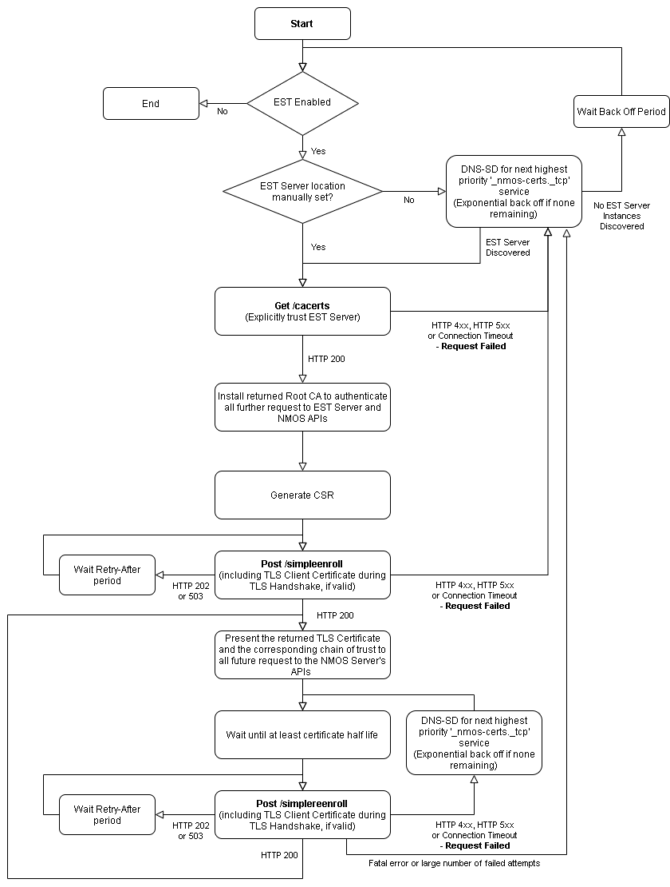

# AMWA BCP-003-03: Certificate Provisioning in NMOS Systems \[Work In Progress\]
{:.no_toc}

* A markdown unordered list which will be replaced with the ToC, excluding the "Contents header" from above
{:toc}

## Scope

This document specifies how to implement automated provisioning of TLS Server Certificates to NMOS APIs.

This is based on best practice used for RESTful APIs, and is intended to promote a secure approach to interoperability.

Use of insecure communication (plain HTTP etc.) is forbidden within the scope of this document.

Implementation of [BCP-003-01][] is recommended alongside implementing this document.

## Use of Normative Language

The key words "MUST", "MUST NOT", "REQUIRED", "SHALL", "SHALL NOT", "SHOULD", "SHOULD NOT", "RECOMMENDED", "MAY", and "OPTIONAL" in this document are to be interpreted as described in [RFC 2119][RFC-2119].

## Normative References

These appear at the end of the Markdown source for this document,
and are referenced as hyperlinks within the main body.

## Definitions

_See also the [NMOS Glossary](https://github.com/AMWA-TV/nmos/wiki/Glossary), and definitions within RFCs._

### API

An HTTP or WebSocket API as defined in an AMWA NMOS Specification (IS-04, IS-05, IS-06, etc.)

### CSR

A Certificate Signing Request, used to request a TLS Certificate from a Certificate Authority, containing the public key and identification information required by the Certificate Authority in the PKCS Format, [RFC 2986][RFC-2986]

### EST

Enrollment over Secure Transport, which defines a profile for requesting TLS certificates over a secure transport protocol

### EST Server

The entity that is providing the EST API in accordance with [RFC 7030][RFC-7030]

### EST Client

The entity that is using the EST API, for example:

- NMOS Servers requesting a TLS Server Certificate
- NMOS Clients requesting the latest Root CA of the domain

### NMOS Server

The entity that is providing an NMOS API, for example:

- Registries implementing IS-04 Registration and Query APIs
- Nodes implementing the IS-04 Node API and IS-05 Connection API

### NMOS Client

The entity that is using the NMOS API, for example:

- Nodes using the IS-04 Registration API
- Monitoring applications using the IS-04 Query API
- Connection control applications using the IS-05 Connection API

## Introduction (informative)

This document covers the automated provisioning of TLS Certificates to NMOS Servers and automated provisioning of CA Certificates to NMOS Clients. These certificates are used to secure communication between NMOS Servers and NMOS Clients.

This document is not concerned with the security of the connection used to carry out provisioning of the TLS Certificate, but for the mechanism described in this document to be effective the connection must be secured, ideally using the recommendations covered in [BCP-003-01][].

## NMOS Client Automated Root CA Certificate Provisioning Flow (informative)

To allow an NMOS Client to validate the TLS Certificates of NMOS Servers in the target network environment, it first needs the Root Certificate Authority certificates.

1. When the NMOS Client (EST Client) is connected to the target environment's network, it will first discover the location of the EST Server using unicast DNS-SD.
2. The NMOS Client will then request the Root CA for the target network, from the EST Server.
   - The NMOS Client can assume the EST Server found using DNS-SD is trusted and need not perform TLS authentication of the EST Server for this initial transaction.
   - The NMOS Client uses the Root CA returned to secure further communications with the EST Server and the NMOS Servers.

The workflow if the NMOS Client is moved to a new network is covered in detail in the [EST Client Behaviour](#est-client-behaviour) section.


## NMOS Server Automated Certificate Provisioning Flow (informative)

To enable zero-configuration TLS Certificate provisioning, NMOS implementations MUST include a unique TLS Client Certificate, signed by the manufacturer's Certificate Authority. Manufacturers MUST provide the corresponding Root Certificate Authority public key to customers, to be loaded into the EST Server. If the TLS Client Certificate or the chain of trust is compromised, the manufacturer must revoke the comprised certificates.

1. Before the NMOS Server (EST Client) is shipped from the factory it must be provisioned with a unique TLS Client Certificate, signed by the manufacturer's Certificate Authority.
2. When the NMOS Server is connected to the target environment's network, it will first discover the location of the EST Server using unicast DNS-SD.
3. The NMOS Server will then request the Root CA for the target network, from the EST Server.
   - The NMOS Server can assume the EST Server found using DNS-SD is trusted and need not perform TLS authentication of the EST Server for this initial transaction.
   - The NMOS Server uses the Root CA returned to secure further communications with the EST Server.
4. The NMOS Server will generate a Certificate Signing Request (CSR) for all supported digital signature algorithms with appropriate key lengths.
   - Ensure the DNS resolvable name for the current domain of the NMOS Server is included in the CSR.
   - Use appropriate values for the remaining CSR fields.
5. The NMOS Server will send each CSR to the EST Server.
   - The NMOS Server will provide the manufacturer-issued certificate during the TLS handshake, if this certificate is valid.
   - The EST Server will use the TLS Client Certificate to authenticate and then authorize the NMOS Server. If the NMOS Server meets the local CA's security policy, it will be issued with a TLS Server Certificate.
6. The NMOS Server will provide the returned TLS Certificate and the corresponding chain of trust in all future responses from its NMOS APIs.

The workflow if no valid manufacturer TLS Client Certificate is present or if the NMOS Server is moved to a new network are covered in detail in the [EST Client Behaviour](#est-client-behaviour) section.



## DNS-SD Advertisement

The EST Server MUST be advertised using unicast DNS-SD as per [RFC 6763][RFC-6763].
The EST Server SHOULD NOT be advertised via mDNS-based DNS-SD.
EST Clients MUST NOT trust an mDNS advertisement for the EST Server unless explicitly configured to do so.
The EST Server MUST be advertised with the following service type:

```
_nmos-certs._tcp
```

The hostname and port of the EST Server MUST be identified via the DNS-SD advertisement, with the full HTTPS URL then being resolved via the use of the path-prefix of `/.well-known/` as defined in [RFC 5785][RFC-5785] and the registered name of `est`. Thus, a valid example EST Server URL begins with `https://www.example.com/.well-known/est/`. A DNS A record MUST be provided to allow the hostname to be resolved.

Multiple DNS-SD advertisements for the same API are permitted where the API is exposed via multiple ports, protocols and/or arbitrary labels.

EST Clients MUST support discovering the EST Server through use of unicast DNS-SD, as described in [RFC 6763][RFC-6763].

### DNS-SD TXT Records

#### pri

The DNS-SD advertisement MUST include a TXT record with key 'pri' and an integer value. Servers MAY additionally present a matching priority via the DNS-SD SRV record 'priority' and 'weight' as defined in [RFC 2782][RFC-2782]. The TXT record should be used in favour of the SRV priority and weight where these values differ, in order to overcome issues in the Bonjour and Avahi implementations. Values 0 to 99 correspond to an active EST Server API (zero being the highest priority). Values 100+ are reserved for development work to avoid colliding with a live system.

#### api_selector

The DNS-SD advertisement MAY include a TXT record with key 'api_selector' and a string value. The 'api_selector' key defines an arbitrary label that if present MUST be appended to the well-known EST path, for example `https://www.example.com/.well-known/est/<arbitrary label>/`. The arbitrary label is specified in [RFC 7030][RFC-7030] and allows multiple EST Server instances on a single host to be used. If the 'api_selector' key is not present in the TXT record, the EST Client MUST NOT append anything to the well-known EST path.

## EST Server Behaviour

The EST Server MUST be implemented in accordance with [RFC 7030][RFC-7030].

### EST Server API

The EST Server SHALL present an instance of the EST API as defined in [RFC 7030][RFC-7030].

The EST Server MUST include the following API endpoints:

| Operation                       | Operation path  |
| ------------------------------- | --------------- |
| Distribution of CA Certificates | /cacerts        |
| Enrollment of Clients           | /simpleenroll   |
| Re-enrollment of Clients        | /simplereenroll |

The EST Server MAY include the following API endpoints:

| Operation                       | Operation path  |
| ------------------------------- | --------------- |
| Server-Side Key Generation      | /serverkeygen   |

### EST Server Authentication

The EST Server MUST present a valid TLS Server Certificate, this Certificate MUST either be signed by the CA for the realm to which it is issuing certificates or by a publicly trusted CA.

### EST Server - Client Authentication

The EST Server MUST authenticate the EST Client before issuing a TLS Certificate as described below.

The EST Server MUST support using a TLS Client Certificate, presented during the TLS handshake by the EST Client to authenticate if the EST Client is trusted. The TLS Client Certificate can either be signed by the current CA or a trusted third-party CA. The EST Server MUST check the validity of the EST Client's TLS Certificate before responding to its request, including checking the TLS certificate's revocation status where applicable.

As the TLS Client Certificate is intended to be used for the lifetime of the device, the validity of the TLS Client Certificate and its corresponding chain of trust SHOULD exceed the intended lifetime of the product. It is therefore RECOMMENDED that this is a minimum of 30 years. The EST Server MAY ignore the validity period of the TLS Client Certificate and authenticate an EST Client using an expired TLS Client Certificate, if it has not been revoked.

The EST Server MUST provide a method to load multiple trusted Root CAs, that are used to verify the TLS Client Certificate.

The EST Server MAY also support manual authentication of the EST Client if:
- No TLS Client Certificate is presented during the TLS handshake
- The TLS Client Certificate is not trusted
- The local security policy requires an extra authentication step

The exact process for manual authentication will be implementation specific, but the EST Server MUST provide enough information to the operator so they can authenticate the EST Client. In accordance with [RFC 7030 - Section 4.2.3](https://tools.ietf.org/html/rfc7030#section-4.2.3), during manual authentication the EST Server MUST respond with HTTP 202 and the response MUST include a `Retry-After` header.

The EST Server MUST not support Basic HTTP Authentication.

The EST Server MUST implement both RSA and ECDSA Digital Signature algorithms for signing TLS Certificates.

The EST Server MUST return a TLS Certificate with the Extended Key Usage set for both TLS Server Authentication and TLS Client Authentication as per [RFC 5280][RFC-5280]. This is to allow the TLS Certificate to be used both as a server certificate to authenticate NMOS APIs to NMOS Clients and for authentication of the EST Client to the EST Server during certificate renewal.

### EST Server-Side Key Generation

The EST Server SHOULD support the server-side key generation endpoint `/serverkeygen` in accordance with [RFC 7030 - Section 4.4](https://tools.ietf.org/html/rfc7030#section-4.4). This endpoint allows devices unable to generate their own key pair with the required entropy to request a TLS certificate.

If the server-side generated key endpoint is supported, the EST Server MUST perform client authentication and authorisation as per [EST Server - Client Authentication](#est-server---client-authentication).

If the EST Client is authenticated and authorised, the EST Server MUST return the TLS Certificate and private key used to sign the certificate.

If requested by the EST Client, the EST Server MUST encrypt the returned private key.

The EST Server SHOULD generate a key of an appropriate length.

In order to accommodate low-powered devices it is RECOMMENDED that signing of TLS Certificates using an RSA key is done by the EST Server, as this is currently computationally complex.

## EST Client Behaviour

The EST Client manufacturer SHOULD issue a unique TLS Client Certificate for every device. It is RECOMMENDED that the `notAfter` value be set to the `GeneralizedTime` value of `99991231235959Z`, defined in [RFC 5280 - Section 4.1.2](https://tools.ietf.org/html/rfc5280#section-4.1.2.5) for when a certificate is intended to be used for the entire lifetime of the device. All certificates in the chain of trust MUST also have their `notAfter` value set to the `GeneralizedTime` value of `99991231235959Z`. A client certificate and chain of trust with the `notAfter` value set to the `GeneralizedTime` value of `99991231235959Z` MUST not be used for anything other than EST Client authentication.

The device manufacturer SHOULD populate the TLS Client Certificate `serialNumber` attribute with the device's unique serial number from [RFC 5280 - Section 4.1.2.2](https://tools.ietf.org/html/rfc5280#section-4.1.2.2)'s list of standard attributes.

The device manufacturer MUST make the public key of the CA available to the customer network administrators. It is RECOMMENDED that manufacturers maintain a public Certificate Revocation List (CRL) and OCSP server.

An EST Client SHOULD allow EST to be disabled, preventing the EST Client from being automatically provisioned with a TLS Certificate, if required by the network's security policy. The default value SHOULD be EST **Enabled**.

An EST Client MUST provide a configuration option to prevent automatic renewal of its TLS Certificate by disabling EST following a successful enrollment. By default, automatic renewals SHOULD be **Enabled** unless a device's primary operation would be impacted by the renewal process. System administrators are strongly RECOMMENDED to monitor these devices for certificate expiry and enable EST manually at a suitable time, forcing the EST Client to perform a renewal.

An EST Client SHOULD allow manual configuration of the EST Server's Hostname, Port and Arbitrary Label, to prevent the EST Client from requesting a TLS Certificate from a rogue server. The default value SHOULD be **Not Set**, enabling DNS-SD discovery.

An EST Client SHOULD allow explicit trust of the EST Server to be disabled, to prevent the EST Client from requesting a TLS Certificate from a rogue EST Server. The default value SHOULD be that explicit trust of the EST Server is **Enabled**. More information about explicit trust of an EST Server can be found in the [Getting the Root CA](#getting-the-root-ca) section.

An EST Client MAY allow externally generated private keys to be loaded and used to sign CSRs; this is intended to support low power devices that are unable to generate their own private key. Care SHOULD be taken to maintain the confidentiality of the private keys externally generated and loaded on the device.

An EST Client MAY maintain a database of implicitly trusted Certificate Authorities, used to verify the identity of the EST Server. It MUST be possible to update this database of implicitly trusted Certificate Authorities. This database needs to be carefully managed to reduce the chance of a third-party CA with poor certification practices from being trusted.

An EST Client MUST provide a method to manually install both the Root Certificate Authority and TLS Server certificate for the target environment, for the case when an EST Server is not present or the TLS Client Certificate is no longer valid.

An EST Client MUST provide a method to replace the manufacturer-issued TLS Client Certificate, for the case when the TLS Certificate has been revoked or expired.

An EST Client MAY ignore all timestamps in the certificate validity periods during the certificate provisioning process if it does not accurately know the current time, see [Bootstrapping Remote Secure Key Infrastructures - Section 2.6.1](https://tools.ietf.org/html/draft-ietf-anima-bootstrapping-keyinfra-41#section-2.6.1) for more information.

An EST Client MUST have access to a good source of randomness in an acceptable amount of time. For more information, refer to [BRSKI](https://datatracker.ietf.org/doc/draft-ietf-anima-bootstrapping-keyinfra/) and [RFC 4086 - Randomness Requirements for Security][RFC-4086].
If an EST Client implements the AMWA IS-04 Node API, then the EST Client SHOULD advertise that it supports BCP-003-03 using the 'tags' attribute of the Node API's `/self` endpoint. Control interfaces can identify all Nodes which support BCP-003-03 by a URN key 'urn:x-nmos:tag:certprov' and a list of enabled BCP-003-03 versions. If BCP-003-03 is disabled the list MUST be empty. This tag is defined in the NMOS Parameter Registers under the [NMOS Tags](https://specs.amwa.tv/nmos-parameter-registers/branches/main/tags/) register.

**Example:** The 'tags' attribute of an NMOS Node
```json
...
"tags": {
  "urn:x-nmos:tag:certprov": [
    "v1.0"
  ]
}
...
```

If the EST Server returns a HTTP redirect, the the EST Client SHOULD follow the redirect URL, renegotiating the TLS session when appropriate.

If the EST Server returns a HTTP 202 or 503 with a `Retry-After` header, the EST Client SHOULD NOT attempt the HTTP request again until the period defined in that header has expired.

If the EST Server returns an HTTP 4xx, HTTP 5xx or Connection Timeout, the EST Client SHOULD attempt the request again using an alternative EST Server if present, else the EST Client SHOULD wait an appropriate exponential backoff period before retrying.

### Initial Certificate Provisioning

#### EST Server Discovery

On connection to the target environment's network, the EST Client SHOULD attempt to discover the location of the EST Server using [DNS-SD](#dns-sd-advertisement), if EST has not been disabled or the location of the EST Server configured manually.

#### Getting the Root CA

There are two possible workflows for installing the Root CA for the target network depending on whether explicit trust of the EST Server is **Enabled** or **Disabled**.

If explicit trust of the EST Server is **Enabled**, the EST Client SHOULD make an HTTPS request to the `/cacerts` endpoint of the EST Server for the latest Root CA of the current network. The EST Client SHOULD explicitly trust the EST Server manually configured or discovered using unicast DNS and not perform authentication of the EST Server's TLS Certificate during the initial request to the EST Server.

If explicit trust of the EST Server is **Disabled**, the EST Client SHOULD make an HTTPS request to the `/cacerts` endpoint of the EST Server for the latest Root CA of the current network. The EST Client MUST perform authentication of the EST Server's TLS Certificate, using the EST Client's current list of trusted Certificate Authorities.

If the EST Server returns an HTTP 200 response, the EST Client SHOULD add the returned Root CA to the list of trusted Certificate Authorities, replacing any previously installed Root CAs which were obtained via EST. It SHOULD also store any intermediate certificates returned, which are used to form the chain of trust for certificates issued by the EST CA.

The EST Client MUST be able to handle the three "Root CA Key Update" certificates OldWithOld, OldWithNew, and NewWithOld in the response, defined in [RFC 4210 - Section 4.4](https://tools.ietf.org/html/rfc4210#section-4.4).

#### Generate Certificate Signing (CSR) Request

The EST Client SHOULD create a CSR for each digital signature algorithm it supports, with an appropriate Key Length. The CSR MUST contain a Common Name and Subject Alternative Names that are resolvable via DNS on the current domain and appropriate values for the other CSR fields.

The EST Client MUST generate a new key pair every time a CSR is generated.

The EST Client MUST NOT use the following hashing algorithms, MD5, SHA-0 or SHA-1, as they are no longer considered secure. EST Clients SHOULD use SHA-2 or higher, until a security vulnerability is discovered and an alternative hashing algorithm is recommended or defined in the relevant TLS specification. Refer to the [NIST Policy on Hash Functions](https://csrc.nist.gov/projects/hash-functions/nist-policy-on-hash-functions).

The CSR request SHOULD populate the `serialNumber` attribute with the device's unique serial number from [RFC 5280 - Section 4.1.2.2](https://tools.ietf.org/html/rfc5280#section-4.1.2.2)'s list of standard attributes.

The CSR request SHOULD include information specific to the current authenticated TLS session within the signed CSR, this is to prevent man-in-the-middle attacks. More information about the linking of identity and proof-of-possession can be found in [RFC 7030 - Section 3.5](https://tools.ietf.org/html/rfc7030#section-3.5).

#### Certificate Request

For each generated CSR, the EST Client SHOULD make an HTTPS request containing the CSR to the `/simpleenroll` endpoint of the EST Server. The EST Client SHOULD include the manufacturer-installed TLS Client Certificate, if present and valid, during the TLS handshake with the EST Server. If the TLS certificate is no longer valid, the [Expired Manufacturer-Issued TLS Client Certificate](#expired-manufacturer-issued-tls-client-certificate) workflow should be followed.

#### Certificate Request Response

If the EST Server returns an HTTP 200 response, the certificate request was successful and the response from the EST Server MUST contain a valid TLS certificate.

Before using the returned TLS certificate the EST Client SHOULD validate the TLS certificate, validating for example the NotBefore, Not After, Common Name, Subject Alternative Name and chain of trust. The validity of the TLS certificate could be checked by installing the certificate and performing a request to the API. If the TLS certificate is successfully validated, the TLS Certificate and its chain of trust SHOULD be used for all further requests to NMOS APIs. The EST Client MUST remove any previously issued TLS Certificates and keys. If the EST Client fails to validate the TLS certificate, the certificate SHOULD not be used and the [Certificate Request Error Response](#certificate-request-error-response) workflow followed.

If the EST Server returns an HTTP 202 or 503, the request was accepted, but the certificate has not been processed yet. The response SHOULD include a `Retry-After` header and the EST Client MUST not attempt resending the request before the defined time has expired. If the TLS session is renegotiated and the CSR includes identity linking information, the CSR will need to be regenerated. The EST Client SHOULD attempt resending the request an appropriate number times before aborting and the [Certificate Request Error Response](#certificate-request-error-response) workflow followed.

The certificate returned by the EST Server need not be valid until some time in the future; the `notBefore` date MUST be checked before using the certificate.

EST Clients MUST implement robust Base64 decoding in order to accept data from a broad range of EST Server implementations, considering the issues identified in [RFC 4648 - Section 3](https://tools.ietf.org/html/rfc4648#section-3) such as the presence of line feeds in encoded data.

#### Certificate Request Error Response

If the EST Server returns any other HTTP response, the request has been unsuccessful. This could be caused by a malformed request, server-side error or the EST Client not being authorised. The EST Client SHOULD restart the EST workflow with an alternative EST Server if present, else the EST Client SHOULD implement an exponential backoff algorithm, with a starting period of 1 second before retrying.

If the EST Client is performing a renewal and the request is unsuccessful, the EST Client SHOULD carry on using the existing TLS Certificate if still valid and reattempt renewal after half of the remaining period of validity has elapsed. If the remaining validity is less than 1 day, the EST Client SHOULD implement an exponential backoff algorithm, with a starting period of 1 second before retrying.

### Certificate Renewal

Renewal of the TLS Certificate SHOULD be attempted no sooner than 50% of the certificate's expiry time or before the `notBefore` date on the certificate. It is RECOMMENDED that certificate renewal is performed after 80% of the expiry time. If the EST Client's TLS Certificate is no longer valid, the [Initial Certificate Provisioning](#initial-certificate-provisioning) workflow should be followed.

The EST Client MUST generate a new key pair and CSR matching the TLS certificate it is being used to replace. The EST Client SHOULD make a request containing the CSR to the `/simplereenroll` endpoint of the EST Server. The EST Client MUST include the TLS Certificate being renewed during the TLS handshake with the EST Server.

EST Client SHOULD handle the EST Server's response as per [Certificate Request Response](#certificate-request-response).

EST Clients SHOULD be implemented so that certificate renewal does not adversely affect operation (e.g. interruption of a media stream or loss of an NMOS control connection).
### Root Certificate Authority Renewal

Renewal of the Root CA SHOULD be attempted no sooner than 50% of the certificate's expiry time. It is RECOMMENDED that certificate renewal is performed after 80% of the expiry time. To renew the Root CA and the EST Client's TLS Certificate, follow the [Initial Certificate Provisioning](#initial-certificate-provisioning) workflow, renewing both the Root CA and server certificates in the process.

If the returned Root Certificate Authority by the EST Server is the same as the existing Root Certificate Authority, the EST Client SHOULD reattempt renewal of the Root Certificate Authority after half of the remaining period of validity has elapsed.

### EST Server-Side Key Generation

An EST Server MAY support server-side key generation, allowing devices to request a TLS Certificate without having to perform the computationally expensive process of generating a private key.

If the EST Server supports server-side key generation, the EST Client MAY make a request to the EST Server endpoint `/serverkeygen` in accordance with [RFC 7030 - Section 4.4](https://tools.ietf.org/html/rfc7030#section-4.4).

The EST Client SHOULD request that the returned private key is encrypted using either symmetric or asymmetric encryption, by including the appropriate information in the CSR.

The EST Client SHOULD include the manufacturer installed TLS Client Certificate if present and valid during the TLS handshake with the EST Server. If the TLS certificate is no longer valid, the [Expired Manufacturer-Issued TLS Client Certificate](#expired-manufacturer-issued-tls-client-certificate) workflow should be followed.

EST Client SHOULD handle the EST Server's response as per [Certificate Request Response](#certificate-request-response).

The EST Client SHOULD be capable of using a TLS Certificate generated using any Digital Signature algorithm, but MUST be capable of using a TLS Certificate signed using an RSA key.

Renewal of the TLS Certificate can either be performed using the existing private key following the [Certificate Renewal](#certificate-renewal) workflow, if the key has not been compromised or rerunning the [EST Server-Side Key Generation](#est-server-side-key-generation) workflow, using the previously issued TLS Certificate for authentication.

### Expired Manufacturer-Issued TLS Client Certificate

If the manufacturer-issued TLS Client Certificate has expired or has been revoked, it MUST NOT be used by the EST Client for authentication. An EST Client MAY attempt to request a TLS Certificate following [Initial Certificate Provisioning](#initial-certificate-provisioning), without providing a TLS Client Certificate during the TLS handshake. If the EST Server supports manual authentication, the request will be processed once manual authentication has been granted.

If the EST Server fails to process the request the following actions MAY be taken:
1. The EST Client MAY have a TLS Certificate for the target network manually installed on the device. The manually installed TLS certificate MUST then be used to secure its NMOS APIs until the TLS Certificate is due for renewal. The manually installed TLS Certificate MUST be presented during the TLS Handshake for [Certificate Renewals](#certificate-renewal). If the certificate renewal is successful, the manually installed TLS Certificate and private key MUST be removed.
2. The manufacturer-issued TLS Client Certificate MAY be renewed by a software/firmware update; this update MUST contain a unique TLS certificate per device. The valid TLS Client Certificate MAY then be used during [Initial Certificate Provisioning](#initial-certificate-provisioning).

### Connection to New Network

It MAY be desirable that when a EST Client is connected to a different network that it automatically requests a TLS Certificate for the new network.

On start up or on change of network state, the EST Client MUST attempt to discover the EST Server using [DNS-SD](#dns-sd-advertisement), unless the location of the EST Server is manually configured. The EST Client SHOULD make a request to the `/cacerts` endpoint. If the request is successful, the EST Client SHOULD compare the returned Certificate to the currently installed Root CA. If the Certificate is for a different domain, the EST Client MUST follow the [Initial Certificate Provisioning](#initial-certificate-provisioning) workflow.

### Certificate Revocation

An EST Client SHOULD periodically check the revocation status of both the Root CA and its TLS Certificates using [OCSP][RFC-6960] and [CRL][RFC-5280]. If a TLS Certificate is revoked, the EST Client MUST stop using the revoked certificate immediately and follow [Initial Certificate Provisioning](#initial-certificate-provisioning) workflow to replace the certificate.

## Security Considerations

Bootstrap Distribution of CA Certificate:
- EST Clients SHOULD implicitly trust the EST Server found using DNS-SD. EST Clients SHOULD NOT validate the chain of trust for the EST Server's TLS Certificate when using the `/cacerts` endpoint.
- EST Clients MUST use the CA returned by the EST Server endpoint `/cacerts` to establish an Explicit Trust Anchor database used for subsequent TLS authentication of the EST Server and NMOS Servers.

- This deviation from the EST specification has been allowed due to the minimal risk around trusting a rogue EST Server.
  - If an EST Client is provisioned with an incorrect CA Certificate by the rogue EST Server the EST Client would not trust NMOS Servers and therefore not divulge sensitive information.
  - If an EST Client is provisioned with a TLS Certificate by the rogue EST Server, the EST Client would not be trusted by other NMOS Clients on the network.

## Further Reading

The IETF RFCs referenced here provide much more information.

[BRSKI][BRSKI] - Bootstrapping Remote Secure Key Infrastructures (BRSKI)

[NIST SP 800-90A][NIST SP 800-90A] - Recommendation for Random Number Generation Using Deterministic Random Bit Generators

[RFC 2119][RFC-2119] - Key words for use in RFCs to Indicate Requirement Levels

[RFC 2617][RFC-2617] - HTTP Authentication: Basic and Digest Access Authentication

[RFC 2782][RFC-2782] - A DNS RR for specifying the location of services (DNS SRV)

[RFC 2986][RFC-2986] - PKCS #10: Certification Request Syntax Specification

[RFC 4086][RFC-4086] - Randomness Requirements for Security

[RFC 4210][RFC-4210] - Internet X.509 Public Key Infrastructure Certificate Management Protocol (CMP)

[RFC 5280][RFC-5280] - Internet X.509 Public Key Infrastructure Certificate and Certificate Revocation List (CRL) Profile

[RFC 5785][RFC-5785] - Defining Well-Known Uniform Resource Identifiers (URIs)

[RFC 8615][RFC-8615] - Well-Known Uniform Resource Identifiers (URIs)

[RFC 6763][RFC-6763] - DNS-Based Service Discovery

[RFC 6960][RFC-6960] - X.509 Internet Public Key Infrastructure Online Certificate Status Protocol - OCSP

[RFC 7030][RFC-7030] - Enrollment over Secure Transport

[BCP-003-01]: https://specs.amwa.tv/bcp-003-01

[BRSKI]: https://tools.ietf.org/html/draft-ietf-anima-bootstrapping-keyinfra-41

[NIST SP 800-90A]: http://dx.doi.org/10.6028/NIST.SP.800-90Ar1

[RFC-2119]: https://tools.ietf.org/html/rfc2119

[RFC-2617]: https://tools.ietf.org/html/rfc2617

[RFC-2782]: https://tools.ietf.org/html/rfc2782

[RFC-2986]: https://tools.ietf.org/html/rfc2986

[RFC-4086]: https://tools.ietf.org/html/rfc4086

[RFC-4210]: https://tools.ietf.org/html/rfc4210

[RFC-5280]: https://tools.ietf.org/html/rfc5280

[RFC-5785]: https://tools.ietf.org/html/rfc5785

[RFC-8615]: https://tools.ietf.org/html/rfc8615

[RFC-6763]: https://tools.ietf.org/html/rfc6763

[RFC-6960]: https://tools.ietf.org/html/rfc6960

[RFC-7030]: https://tools.ietf.org/html/rfc7030
